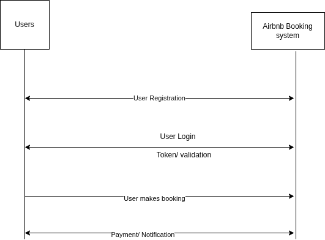

# Requirement Analysis in Software Development

## Introduction

This repository serves as the foundation for the Requirement Analysis phase of a software project. It is part of the "FeatureForge: Crafting Your Project Blueprint" initiative, focusing on the documentation and analysis of system requirements.

The goal is to simulate a real-world Airbnb booking management system project and create a comprehensive blueprint that includes functional and non-functional requirements, use case diagrams, and acceptance criteria. This work lays the groundwork for efficient, scalable, and successful software development.

## What is Requirement Analysis?

Requirement Analysis is a fundamental phase in the Software Development Life Cycle (SDLC) that involves understanding, documenting, and validating the needs and expectations of stakeholders. It lays the groundwork for system design and development by ensuring that all requirements are captured accurately and comprehensively.

### Why is Requirement Analysis Important?

- **Clarity and Understanding**: Helps identify what stakeholders truly need, reducing ambiguity and ensuring everyone is on the same page.
- **Scope Definition**: Clearly outlines the boundaries of the project, helping to avoid scope creep and ensuring deliverables remain focused.
- **Basis for Design and Development**: Provides a solid foundation for creating system architecture and development plans.
- **Cost and Time Estimation**: Enables more accurate budgeting, resource allocation, and scheduling.
- **Quality Assurance**: Ensures that the developed system meets specified requirements, boosting customer satisfaction.

## Key Activities in Requirement Analysis

Requirement Analysis involves several critical activities that ensure the software development process starts on a strong foundation. Below are the five key activities:

### 1. Requirement Gathering 
- **Interviews**: Conducting one-on-one or group interviews with stakeholders to understand their expectations and needs.
- **Surveys/Questionnaires**: Distributing structured forms to collect input from a broader audience.
- **Workshops**: Hosting collaborative sessions with stakeholders to extract and clarify requirements.
- **Observation**: Watching users interact with current systems or processes to uncover real needs.
- **Document Analysis**: Reviewing existing documentation, reports, and systems for background and insights.

### 2. Requirement Elicitation 
- **Brainstorming**: Generating a wide range of ideas in group settings to surface potential requirements.
- **Focus Groups**: Facilitated discussions with a selected group of stakeholders to explore specific requirements in depth.
- **Prototyping**: Building quick mock-ups or simulations to help stakeholders visualize the system and refine their needs.

### 3. Requirement Documentation 
- **Requirement Specification Document**: Detailed, structured listing of all functional and non-functional requirements.
- **User Stories**: Short narratives that describe a user’s need and the value it provides.
- **Use Cases**: Diagrams or descriptions that depict interactions between users and the system.

### 4. Requirement Analysis and Modeling 
- **Requirement Prioritization**: Ranking requirements based on importance, value, and feasibility.
- **Feasibility Analysis**: Evaluating whether the requirements are technically and economically achievable.
- **Modeling**: Creating visual models such as Data Flow Diagrams (DFDs) and Entity-Relationship Diagrams (ERDs) to better understand and communicate requirements.

### 5. Requirement Validation 
- **Review and Approval**: Conducting reviews with stakeholders to confirm the documented requirements are accurate and complete.
- **Acceptance Criteria**: Defining measurable standards that requirements must meet to be accepted.
- **Traceability**: Linking each requirement to its origin and ensuring it is addressed throughout development and testing.

## Types of Requirements

In software engineering, requirements are generally categorized into two broad types: Functional and Non-functional. Both are essential for building a complete and successful system.

### Functional Requirements

Functional requirements define what the system should do — the specific behaviors, features, and functions that must be implemented.

**Examples for the Airbnb Booking Management System:**

- **User Registration & Login**: Users must be able to create an account, log in, and manage their profile.
- **Search Listings**: Users should be able to search for accommodations based on filters such as location, price, and availability.
- **Booking Management**: Users must be able to book available listings and view or cancel their bookings.
- **Payment Integration**: The system should allow users to pay securely using various payment methods like credit card, PayPal, or mobile money.
- **Host Dashboard**: Hosts should be able to list their properties, set availability, pricing, and manage incoming booking requests.
- **Notifications**: Both hosts and guests should receive confirmation emails or push notifications upon successful booking, cancellation, or payment.

### Non-functional Requirements

Non-functional requirements specify how the system performs its functions. These are often related to system attributes such as performance, usability, reliability, and security.

**Examples for the Airbnb Booking Management System:**

- **Performance**: The system should be able to handle up to 10,000 concurrent users without degradation in response time.
- **Availability**: The platform must be available 99.9% of the time (excluding scheduled maintenance).
- **Usability**: The user interface should be intuitive and mobile-friendly for ease of use by a global audience.
- **Security**: User data must be encrypted at rest and in transit. Authentication should follow OAuth 2.0 standards.
- **Scalability**: The application should be able to scale horizontally to accommodate an increasing number of listings and bookings.
- **Compliance**: The system must comply with GDPR and other regional data protection regulations.

## Acceptance Criteria
Acceptance Criteria are specific, clear, and testable conditions that a software product must satisfy to be accepted by the client or end-user. They serve as a contract between stakeholders and developers, ensuring everyone has a shared understanding of what "done" means for a particular feature or requirement.

## Why Acceptance Criteria Are Important
- Clarify Requirements: Define exactly what needs to be delivered.

- Guide Testing: Provide the foundation for user acceptance testing (UAT).

- Improve Communication: Align expectations between business and technical teams.

- Ensure Quality: Reduce ambiguity and rework by making requirements measurable.

Example: Acceptance Criteria for the Checkout Feature
Feature: Checkout from Booking System

## Use Case Diagrams

### What are Use Case Diagrams?

Use Case Diagrams are visual representations that show the interactions between different actors (users or external systems) and the system. They illustrate what functionalities the system offers to each actor and how these actors interact with the system to achieve their goals.

### Benefits of Use Case Diagrams:
- **Clarifies system functionality**: Helps stakeholders visualize how users interact with the system.
- **Identifies system scope**: Clearly defines which system functionalities are part of the scope.
- **Helps in requirement gathering**: Useful during the requirement analysis phase to ensure all system functionalities are captured.
- **Facilitates communication**: Makes it easier for both technical and non-technical stakeholders to understand system requirements.

### Booking System Use Case Diagram

Here is the use case diagram for the booking system:

Acceptance Criteria:

The user must be logged in to proceed with checkout.

The checkout page must display the booking summary, including property details, dates, and total cost.

The user must be able to enter or select a saved payment method.

The system must validate the payment method before processing.

Upon successful payment, a confirmation message with a unique booking ID should be displayed.

The booking record must be saved in the system and visible in the user’s booking history.

The host should receive a notification upon successful booking.

